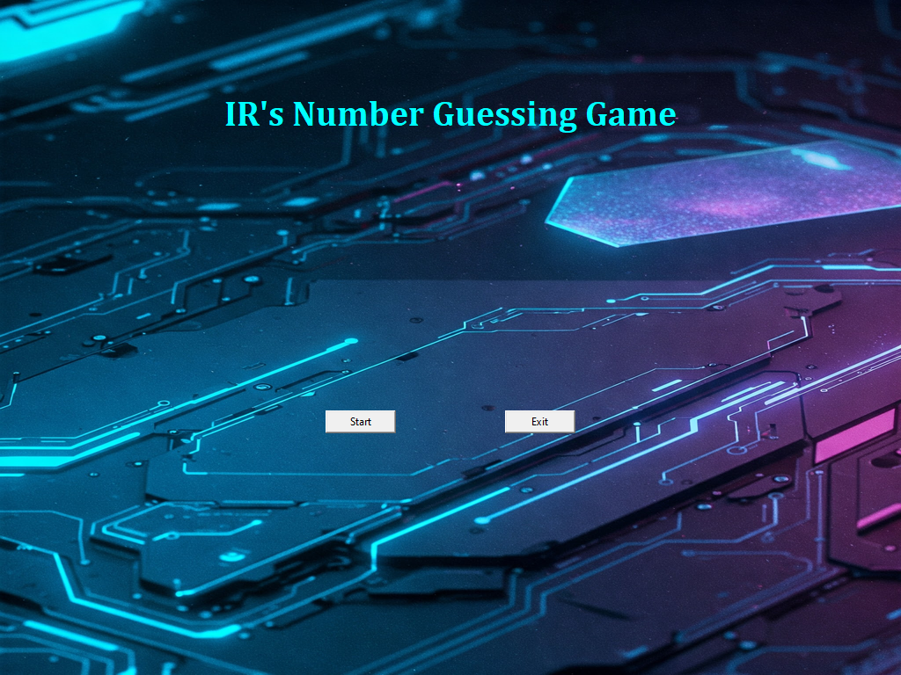

<p align="center">
  
</p>

<p align="center">
  
</p>

<h2 align="center">🎯 A Retro-Modern Number Game in Python — Built with Logic, Styled by Vision</h2>

---

<p align="center">
  
  
  
  
</p>

---

### 🧠 IR - Guess The Number

> *Where your mind races against randomness.*  
> A sleek number guessing game built with **PyQt5**, wrapped in custom visuals and interactive hints — brought to life by **Cipher Shadow IR (Ishaan Ray)**.

---

### 🔍 What's It All About?

- 🔢 **Pick a number between 1 and 100**  
- 🤖 Game gives feedback: “Too High”, “Too Low”, or “Correct!”  
- 🔄 Restart or Exit with clean UI buttons  
- 🎨 Custom-designed background and button icons  
- ⚡ No command-line needed — everything in GUI

---

### 📸 Screenshots

| 🎮 Main Game Window | ✅ Victory Popup |
|---------------------|------------------|
|  |  |

> *Make sure image paths are preserved for full visual effect.*

---

### 🗂 Folder Structure

```plaintext
IR-GTN/
├── 4. Number Guessing Game.py        # Main Game File
├── README.md                         # This stylized documentation
└── assets/
    ├── background/
    │   ├── bg1.jpg                   # Initial window background
    │   ├── bg2.jpg                   # In-game background
    │   └── bg3.jpg                   # Victory or result screen
    └── icons/
        ├── Start icon.png
        └── Exit icon.png
````

---

### ⚙️ How To Play

#### 🛠 Requirements

Make sure you're running Python 3.10+ and install PyQt5:

```bash
pip install pyqt5
```

#### ▶️ Launch The Game

```bash
python "4. Number Guessing Game.py"
```

---

### 🧩 Core Features

* 🎯 **Random Number Engine**
  Generates a number from 1 to 100 for every new session

* 📣 **Intelligent Hints**
  Clear text prompts guide your next move

* 👁️‍🗨️ **GUI-Based Feedback**
  Interactive popups notify you of success

* 🔘 **Start & Exit Buttons**
  No terminal needed, just click to play

---

### 🛠️ Under The Hood

* 👁️‍🗨️ **PyQt5 Widgets** – for all layout & logic
* 🖼️ **QPixmap & QLabel** – render image backgrounds & icons
* 📋 **LineEdit + PushButton** – for smooth input & interaction
* 🎨 **Inline Styling** – for polished, centered GUI aesthetics

---

### 📌 Planned Enhancements

* 🧠 Difficulty Levels (Easy / Hard)
* 🏁 Attempt Counter + High Score Tracker
* 🔊 Sound & Music Effects
* 🌒 Dark/Light Mode toggle
* 📤 Shareable Result Popups

---

### 💬 Developer Profile

**👨‍💻 Ishaan Ray**
🧠 Pythonist | Visual GUI Architect | Code Visionary
📧 [ishaanray.cs.19@gmail.com](mailto:ishaanray.cs.19@gmail.com)
📞 +91 98792 97676

---

### 🎨 Why Build This?

> *Every programmer builds a guessing game — I just gave it a visual soul.*

* Learn PyQt5 fundamentals
* Explore GUI design with Python
* Build logic + interactivity from scratch
* Have fun playing what you build

---

### 📖 License & Credits

This project is free to use, remix, and enhance — for learning or showcasing.
Please **credit** the author when sharing or forking the project publicly. Respect creativity 💡

---

<p align="center">
  <br><br>
  <b>Keep Guessing. Keep Winning. Let Logic Lead.</b><br>
  <i>~ Cipher Shadow IR</i>
</p>
